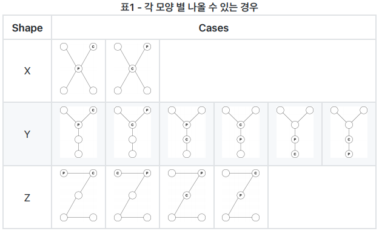
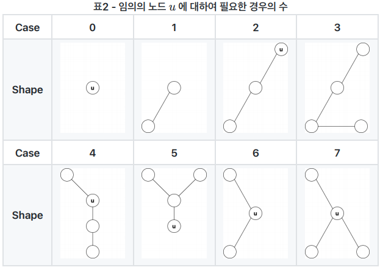
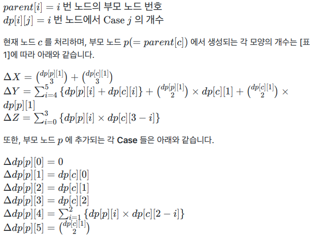

# KPSC 2020-01 환영대회 에디토리얼

## A. 자릿값

* 출제자: 박정현


구현

자릿값을 출력한다.


```c++
#include <iostream>
#include <vector>
#include <cmath>
#include <algorithm>
#include <climits>
#include <set>
#include <map>
#include <queue>
#include <deque>
#include <stack>
#include <string>
#include <list>
#include <ctime>
#include <complex>
#include <bitset>
#include <tuple>

#define ff first
#define ss second

using namespace std;
using pii=pair<int,int>;
using ll=long long;

int main()
{
    ios::sync_with_stdio(false);
	cin.tie(0);
    
    int t;
    cin>>t;
    while(t--){
        int n;
        cin>>n;
        int tmp=10000;
        bool check=true;
        while(tmp!=0){
            if(n/tmp!=0) check=false;
            if(!check){
                cout<<n/tmp*tmp<<" ";
                n=n-n/tmp*tmp;
            }
            tmp/=10;
        }
        cout<<"\n";
    }

    return 0;
}
```


## B. 게임 서버

* 출제자: 박정현

정렬

누가 로그인/로그아웃을 했는지는 동시접속자 수를 구하는 과정에서 중요하지 않다.

로그인/로그아웃 이벤트를 따로 분리해서 시간 순으로 정렬한 후 시간 순서대로 차례대로 이벤트를 처리해가면서 동시 접속자 수를 계산해나가면 된다.

이때, 발생한 시간이 같은 이벤트들 중에서는 로그인 이벤트가 우선 처리되도록 해야한다.

시간복잡도: O(NlogN)

```c++
#include <iostream>
#include <vector>
#include <cmath>
#include <algorithm>
#include <climits>
#include <set>
#include <map>
#include <queue>
#include <deque>
#include <stack>
#include <string>
#include <list>
#include <ctime>
#include <complex>
#include <bitset>
#include <tuple>
#include <random>

#define ff first
#define ss second

using namespace std;

using ll=long long;
using ull=unsigned long long;
using pii=pair<int,int>;
using pll=pair<ll,ll>;

int main()
{
    int n;
    cin>>n;
    vector<pii> v(n*2);
    for(int i=0; i<n; i++){
        int s,e;
        cin>>s>>e;
        v[2*i]={s,0};
        v[2*i+1]={e,1};
    }
    sort(v.begin(),v.end());
    int answer=0;
    int now=0;
    for(int i=0; i<v.size(); i++){
        if(v[i].ss==0) now+=1;
        else now-=1;
        answer=max(answer,now);
    }
    cout<<answer;
    return 0;
}
```


## C. 사다리 타기

* 출제자: 박정현


Map

세로선에서는 아래로 이동하다가 "인접한 두 세로선을 연결하는 선"의 끝점을 만나면 그 선을 따라 인접한 세로선으로 이동한다.

즉, 세로선에 연결된 끝점들을 정렬해두면 O(N)에 각 "인접한 두 세로선을 연결하는 선"에 대해서 양 끝점에 도달했을 때 다음에 도달할 "인접한 두 세로선을 연결하는 선" 정보를 미리 구해놓을 수 있다.

이 정보를 이용해서 각 시작점에서 도착 세로선까지의 경로를 Disjoint-Set 자료구조를 이용해서 경로 압축을 해두면 각 시작점에 대해 O(1) 시간복잡도로 도착 세로선을 구할 수 있다.

경로가 유일하기 때문에 겹치는 경로가 등장할 수 없어서 모든 시작점에 대해 시뮬레이션을 해도 시간복잡도는 O(N)이다.

시간 복잡도: O(NlogN)

다른 풀이로는, 경로가 유일하기 때문에 겹치는 경로가 등장할 수 없어서 모든 시작점에 대해 시뮬레이션을 해도 시간복잡도는 O(N)이다. 그래서 각 시작점에 대해 직접 시뮬레이션을 해서 도착 세로선을 구해도 된다.


```c++
#include <iostream>
#include <vector>
#include <cmath>
#include <algorithm>
#include <climits>
#include <set>
#include <map>
#include <queue>
#include <deque>
#include <stack>
#include <string>
#include <list>
#include <ctime>
#include <complex>
#include <bitset>
#include <tuple>
#include <random>

#define ff first
#define ss second

using namespace std;

using ll = long long;
using ull = unsigned long long;
using pii = pair<int, int>;
using pll = pair<ll, ll>;

int uf_find(vector<int>& v, int a)
{
    if (v[a] == a) return a;
    return v[a] = uf_find(v, v[a]);
}

void uf_union(vector<int>& v, int a, int b)
{
    int ap = uf_find(v, a);
    int bp = uf_find(v, b);
    if (ap == bp) return;
    v[ap] = bp;
}

int main()
{
    int n,m,k;
    cin>>n>>m>>k;
    vector<vector<pair<int, int>>> v(n);
    vector<int> goal(m * 2);
    for(int i=0; i<m; i++){
        int a,b,c;
        cin>>a>>b>>c;
        a-=1;
        v[a].push_back({ b,2 * i });
        v[a + 1].push_back({ c,2 * i + 1 });
        goal[i * 2] = a + 1;
        goal[i * 2 + 1] = a;
    }
    for (int i = 0; i < n; i++) sort(v[i].begin(), v[i].end());
    vector<int> nxt(m * 2);
    for (int i = 0; i < m * 2; i++) nxt[i] = i;
    for (int i = 0; i < n; i++) {
        for (int j = 1; j < v[i].size(); j++) {
            int idx1 = v[i][j - 1].second;
            if (idx1 % 2) idx1 -= 1;
            else idx1 += 1;
            int idx2 = v[i][j].second;
            uf_union(nxt, idx1, idx2);
        }
    }
    vector<int> answer(n);
    for (int i = 0; i < n; i++) {
        if (v[i].empty()) answer[i] = i;
        else {
            int idx = uf_find(nxt, v[i][0].second);
            answer[goal[idx]] = i;
        }
    }
    for(int i=0; i<n; i++) cout<<answer[i]+1<<" ";
    return 0;
}
```


## D. 통나무 자르기

* 출제자: 박정현


이분 탐색(파라메트릭 서치)

임의의 수 L에 대해서 통나무를 다 절단했을 때 가장 긴 통나무의 길이를 반올림한 값을 L이하로 만들 수 있는지 없는지 판단할 수 있다면 이분 탐색으로 가장 작은 L을 찾아낼 수 있다.

따라서, 가장 긴 통나무의 길이를 반올림한 값을 L로 만들 수 있는지 판단할 수만 있으면 된다.

정답이 L이 되려면 절단한 통나무들의 길이가 (L + 0.5) 미만으로 만들 수 있어야 한다.

길이가 (L + 0.5)이 되도록 절단했을 때 절단기를 K번보다 많이 사용해야하거나, 절단기를 K번 사용했지만 모든 절단된 통나무의 길이가 (L + 0.5) 인 경우만 아니라면 (L + 0.5)의 통나무에서 미세한 길이만큼 짧게 자르고 남은 통나무를 좀 더 길게 자르면 되기 때문에 무조건 가능하다.

각 L에 대해서 가능여부를 판단하는데 O(N), 이분 탐색을 수행하는데 O(logN)이 들어서 총 시간복잡도는 O(NlogN)이 된다.

실수 연산은 오차가 발생할 수 있기때문에 x10 을 해서 정수연산으로 계산하는 것이 안전하다.

시간복잡도: O(logN)


```c++
#include <iostream>
#include <vector>
#include <cmath>
#include <algorithm>
#include <climits>
#include <set>
#include <map>
#include <queue>
#include <deque>
#include <stack>
#include <string>
#include <list>
#include <ctime>
#include <complex>
#include <bitset>
#include <tuple>

#define ff first
#define ss second

using namespace std;
using pii=pair<int,int>;
using ll=long long;

int main()
{
    ios::sync_with_stdio(false);
	cin.tie(0);
    
    ll n,k;
    cin>>n>>k;
    vector<ll> a(n);
    for(int i=0; i<n; i++) cin>>a[i];
    ll maxa=*max_element(a.begin(),a.end());
    ll lo=0,hi=maxa+1;

    while(lo<hi){
        ll mid=(lo+hi)/2;
        ll m=maxa-mid;
        ll cnt=0;
        for(int i=0; i<n; i++){
            cnt+=(a[i]*10)/(m*10+5);
        }
        if(cnt<=k) lo=mid+1;
        else hi=mid;
    }
    cout<<maxa-lo+1;

    return 0;
}
```


## E. 열등고등학교

* 출제자: 박정현

Disjoint-Set(유니온 파인드)

Disjoint-Set을 이용해서 친구 관계를 그룹짓고 그룹의 크기를 O(N)으로 빠르게 구한다.

각 그룹마다 과반수가 될 정도의 학생들만 우등생으로 만들면 되기 때문에 각 그룹에 속한 학생수의 가장 작은 과반수를 누적하면 답을 구할 수 있다.

시간복잡도: O(N)

다른 풀이로는 Disjoint-Set이 아닌 DFS/BFS로 탐색된 모든 친구들을 한 그룹으로 만드는 것도 가능하다.


```cpp
#include <iostream>
#include <vector>
#include <cmath>
#include <algorithm>
#include <climits>
#include <set>
#include <map>
#include <queue>
#include <deque>
#include <stack>
#include <string>
#include <list>
#include <ctime>
#include <complex>
#include <bitset>
#include <tuple>

#define ff first
#define ss second

using namespace std;
using pii=pair<int,int>;
using ll=long long;

int uf_find(vector<int> &p, int a)
{
    if(p[a]==a) return a;
    return p[a]=uf_find(p,p[a]);
}

void uf_union(vector<int> &p, vector<int> &siz, int a, int b)
{
    int ap=uf_find(p,a),bp=uf_find(p,b);
    if(ap==bp) return;
    p[max(ap,bp)]=min(ap,bp);
    siz[min(ap,bp)]+=siz[max(ap,bp)];
}

int main()
{
    ios::sync_with_stdio(false);
	cin.tie(0);
    
    int n,m;
    cin>>n>>m;
    vector<int> parent(n);
    vector<int> siz(n,1);
    for(int i=0; i<n; i++) parent[i]=i;
    for(int i=0; i<m; i++){
        int a,b;
        cin>>a>>b;
        uf_union(parent,siz,a-1,b-1);
    }
    vector<bool> check(n);
    int answer=0;
    for(int i=0; i<n; i++){
        int p=uf_find(parent,i);
        if(check[p]) continue;
        check[p]=true;
        answer+=siz[p]/2+1;
    }
    cout<<answer;

    return 0;
}
```


## F. 당신은 한 번만 봅니다

* 출제자: 윤상건

수학 / 이분탐색

두 가지 방법을 이용하여 해결할 수 있다.

가장 간단한 방법은 `atan2()`를 이용하여 해결하는 것이고 다른 방법은 이분탐색을 이용하여 적절한 각을 찾는 것이다.

그렇다면 각에 대한 식을 세우면 되는데, 이는 기울어진 직사각형에 대한 Bounding Box를 그려서 식을 유도할 수 있다.

식을 유도하면 Bounding Box의 위치는 중요하지 않음을 알 수 있고, 따라서 주어진 가로, 세로 값과 비율을 사용하여 답을 구할 수 있다.

```cpp
#include <iostream>
#include <cmath>
#define MAXN 100
#define MAXM 1000000
using namespace std;

typedef long double ldb;

int N, M;
ldb C[MAXN];
ldb thetaSearch(ldb r, ldb R){
  ldb theta = 0;

  int MAX_ITR = 50;
  ldb l = 0, u = M_PI / 2;
  for(int j = 0; j < MAX_ITR; ++j){
    ldb x = (l + u) / 2;
    ldb y = (sin(x) + r * cos(x)) / (r * sin(x) + cos(x));
    if(y > R){
      u = x;
    }else if(y < R){
      l = x;
    }
    theta = x;
  }
  return theta;
}
int main(){
  ios::sync_with_stdio(false);
  cin.tie(0);
  cout.precision(4);
  cin >> N >> M;
  for(int j = 0; j < N; ++j)
    cin >> C[j];
  for(int j = 0; j < M; ++j){
    int c, x, y, w, h;
    cin >> c >> x >> y >> w >> h;
    ldb R = (double)h / w;
    ldb theta = thetaSearch(C[c - 1], R);
    cout << fixed << theta << "\n";
  }
  return 0;
}
```


## G. 유한 힐베르트 호텔

* 출제자: 윤상건

자료구조 / 구간합 / 이분탐색 / 좌표압축

가장 naive한 방법은 매번 쿼리가 주어지면 배열에서 필요한 값을 삽입하고 제거하는 것이다. 하지만 이 경우 삽입에 필요한 비용이 크기 때문에 문제를 해결할 수 없다.

삽입 연산을 빠르게 처리하기 위해 `set`과 같은 `BBT` 자료구조를 활용할 수 있지만, 이 경우에는 x번째 값을 찾는 연산을 빠르게 처리할 수 없다.

이를 해결하기 위한 방법으로 구간합을 활용할 수 있다. 구간합을 이용하면 임의의 수 x가 주어졌을 때, x이하의 값을 등급으로 가지는 방의 개수를 구할 수 있다. 이를 이용하면 n번째 값을 이분탐색으로 빠르게 찾을 수 있다.

그렇다면 구간합에서 삽입/삭제 연산을 빠르게 반영할 수 있는 자료구조가 필요한데, 이는 Fenwick tree 또는 Segment tree 등의 자료구조로 구현할 수 있다.

```cpp
#include <iostream>
#include <vector>
#include <cmath>
#include <algorithm>
#include <climits>
#include <set>
#include <map>
#include <queue>
#include <deque>
#include <stack>
#include <string>
#include <list>
#include <ctime>
#include <complex>
#include <bitset>
#include <tuple>
#define MAXN 200000
using namespace std;
 
typedef long long int lli;
 
int N, Q, A[MAXN + 1], FW[MAXN + 1], ans = -1;
void fw_update(int idx, int v){
  for(int j = idx; j <= MAXN; j += -j&j){
    FW[j] += v;
  }
}
int fw_get(int idx){
  int ret = 0;
  for(int j = idx; j; j -= -j&j)
    ret += FW[j];
  return ret;
}
int findNum(int ord){
  int l = 1, r = MAXN;
  while(l <= r){
    int mid = (l + r) >> 1;
    int cnt = fw_get(mid);
    int cnt_l = fw_get(mid - 1);
    if(cnt_l < ord && ord <= cnt)
      return mid;
    else if(ord > cnt){
      l = mid + 1;
    }else if(ord <= cnt_l){
      r = mid - 1;
    }
  }
  return -1;
}
int main(){
  ios::sync_with_stdio(false);
  cin.tie(0);
  cin >> N >> Q;
  vector<int> nn;
  set<int> vv;
  for(int j = 0; j < N; ++j){
    int a; cin >> a;
    nn.push_back(a);
    vv.insert(a);
  }
  vector<pair<int, int>> q;
  for(int j = 0; j < Q; ++j){
    int t, x; cin >> t >> x;
    q.push_back({t, x});
    if(t == 0) vv.insert(x);
  }
  map<int, int> comp, recomp;
  for(auto itr = vv.begin(); itr != vv.end(); ++itr){
    comp[*itr] = comp.size() + 1;
    recomp[comp.size()] = (*itr);
  }
  for(int j = 0; j < N; ++j){
    int a = comp[nn[j]];
    A[a]++;
    fw_update(a, 1);
  }
  for(int j = 0; j < Q; ++j){
    int t = q[j].first;
    int x = q[j].second;
    if(t == 0){
      x = comp[x];
      A[x]++;
      fw_update(x, 1);
      continue;
    }
    int n = findNum(x);
    if(n != -1){
      A[n]--;
      fw_update(n, -1);
    }
  }
  bool f = false;
  for(int j = 1; j <= MAXN; ++j){
    while(A[j]--){
      f = true;
      cout << recomp[j] << " ";
    }
  }
  if(!f) cout << "-1";
  return 0;
}

```


## H. 석탄 나르기

* 출제자: 허준영(외부 출제자)

그리디

문제를 요약하면 주어진 수열을 증가수열/감소수열 두개로 분리할 수 있는지 여부를 물어보는 문제이다.

n이 500,000이기 떄문에 $O(N^2)$ 솔루션으로는 풀리지 않는다.
우리는 다음과 같은 방법으로 항상 greedy하게 solution을 만들 수 있다.
index가 증가함에 따라 점차 증가하는 배열 A, 점차 감소하는 배열 B를 상정한다.

1번 원소부터 아래 규칙에 따라 A, B에 넣는다.
1. A, B 배열 둘 다 넣지 못하면 "NO" 출력
2. A, B 둘 중 하나에만 넣을 수 있으면 그 배열에 원소 삽입
3. A, B 배열 둘 다 넣을 수 있다면 3-1 ~ 3.3 과정 진행
3-1. i+1번째 원소를 확인한다.
3-2. 만약 i+1번째 원소가 i번째 원소보다 크거나 같으면 i번째 원소를 A에 넣는다.
3-3. 만약 i+1번째 원소가 i번째 원소보다 작으면 i번째 원소를 B에 넣는다.

Proof.
i+1번쨰 원소가 i번째 원소보다 큰데도 불구하고 i번째 원소를 B에 넣어버리면 i+1번째 원소를 B에 넣을 수 있는 선택권이 제한된다.
이는 무조건 손해이다.
i+1번째 원소가 작은것도 마찬가지로 접근하면 된다.

```cpp
#include <iostream>
#include <iomanip>
#include <vector>
#include <cmath>
#include <algorithm>
#include <climits>
#include <set>
#include <map>
#include <queue>
#include <deque>
#include <stack>
#include <string>
#include <list>
#include <ctime>
#include <complex>
#include <bitset>
#include <tuple>
#include <functional>

using namespace std;

#define IOS ios::sync_with_stdio(false);cin.tie(0)
#define all(x) x.begin(), x.end()
#define ff first
#define ss second
#define MOD 1000000007LL
#define rep(i,a,n) for (int i=a ; i<n ; i++)
#define per(i,a,n) for (int i=n-1 ; i>=a ; i--)
#define LLINF 100000000000000005LL
#define INF 1e9+1
#define endl '\n'
#define pb push_back

using llong = long long;
using VI = vector<int>;
using VLL = vector<long long>;
using PII = pair<int, int>;

int main()
{
    IOS;

    int n;
    cin >> n;
    VI a(n);
    VI inc, dec;
    VI ans;
    int min = INF, max = -INF;
    rep(i, 0, n) {
        cin >> a[i];
    }
    rep(i, 0, n) {
        if (a[i] < min && a[i] > max) {
            if (i == n - 1) {
                inc.push_back(a[i]);
            }
            else {
                if (a[i + 1] >= a[i]) {
                    inc.push_back(a[i]);
                    max = a[i];
                }
                else {
                    dec.push_back(a[i]);
                    min = a[i];
                }
            }
        }
        else if (a[i] < min) {
            dec.push_back(a[i]);
            min = a[i];
        }
        else if (a[i] > max) {
            inc.push_back(a[i]);
            max = a[i];
        }
        else {
            cout << "NO";
            return 0;
        }
    }
    cout << "YES" << endl;

    return 0;
}
```


## I. 플랫랜드2: 전쟁의 시작

* 출제자: 윤상건

자료구조 / 기하 / 수학 / 구간합 / 라인스위핑 / 투포인터 / GCD

우선, 모든 원의 중심점을 주어진 직선에 투영해야 한다. 투영했을 때의 좌표는 간단한 수학적 유도를 통해 알아낼 수 있다.

여기서 주의할 점은 실수 오차가 발생할 수 있다는 점이다. 겹쳐있는 위치가 중요한 문제이기 때문에 실수 오차로 인해 답이 달라질 수 있다. 이 문제를 해결하기 위해 분수로 실수를 관리해 주는 클래스나 구조체를 만들 수 있다. 문제에서 주어진 `a`, `b`값을 피타고라스 수로 제한했기 떄문에 무리수가 발생하지 않음을 알 수 있고, 따라서 모든 수를 분수 체계로 관리해 줄 수 있다.

이후 투영된 좌표의 x값이 증가하는 순서로 좌표압축을 해준다. 거리를 고려해줄 필요가 없다는 점을 이용하여 문제를 단순화한 것이다.

좌표압축이 되었다면 선을 2개를 그어 최댓값을 찾는 작업을 수행해야 한다. 이 작업은 라인스위핑을 통해 선 1개를 압축된 좌표들에 대해서 그으면서 각 경우에 대해 가장 많은 원이 존재하는 구간의 값을 구하면 된다.

가장 많은 원이 존재하는 구간의 값은 구간합을 이용하여 구할 수 있다. 각 원마다 자신이 커버하는 좌표들에 +1을 해준 배열에서 최댒값을 구하면 되기 때문이다. 이는 Segment tree를 이용하여 빠르게 처리할 수 있다.

이때, segment tree가 첫번째로 그은 선이 커버한 원들은 제외하도록 해야 하는데, 이는 라인스위핑 과정에서 투포인트의 형태로 segment tree에 제외되는 원들과 새로 추가되는 원들의 구간을 lazy propagation을 이용하여 빠르게 업데이트 해주면 된다.

```cpp
#include <iostream>
#include <vector>
#include <cmath>
#include <algorithm>
#include <climits>
#include <set>
#include <map>
#include <queue>
#include <deque>
#include <stack>
#include <string>
#include <list>
#include <ctime>
#include <complex>
#include <bitset>
#include <tuple>
using namespace std;
 
typedef long long int lli;

struct fraction{
  lli x, y; // x / y

  fraction(lli x, lli y){
    bool mm = false;
    if(x * y < 0){
      mm = true;
    }
    if(x == 0 && y == 0){
      x = 0; y = 1;
    }
    if(x < 0) x = -x;
    if(y < 0) y = -y;
    lli g = gcd(x, y);
    x /= g;
    y /= g;
    if(mm) x = -x;

    this->x = x;
    this->y = y;
  }
  lli gcd(lli a, lli b){
    return b ? gcd(b, a % b) : a;
  }

  fraction operator+(const fraction& frac) const{
    return fraction(frac.y * x + y * frac.x, y * frac.y);
  }
  fraction operator-(const fraction& frac) const{
    return fraction(frac.y * x - y * frac.x, y * frac.y);
  }
  fraction operator*(const fraction& frac) const{
    return fraction(x * frac.x, y * frac.y);
  }
  fraction operator-() const{
    return fraction(-x, y);
  }

  bool operator<(const fraction& frac) const{
    return x * frac.y < frac.x * y;
  }
  bool operator>(const fraction& frac) const{
    return x * frac.y > frac.x * y;
  }
  bool operator==(const fraction& frac) const{
    return x * frac.y == frac.x * y;
  }
};

 
template<class T>
class SegmentTreeWithLazy{
public:
  int n;
  vector<T> segtree;
  vector<T> lazy;

  SegmentTreeWithLazy(int n) {
    this->n = n;
    int siz = 1 << ((int)ceil(log2(n)) + 1);
    segtree.resize(siz);
    lazy.resize(siz);
  }

  void lazypropagation(int ns, int ne, int pos) {
    if (lazy[pos] != 0) {
      segtree[pos] += lazy[pos]; //(ne - ns + 1) * lazy[pos];
      if (ns != ne) {
        lazy[pos * 2] += lazy[pos];
        lazy[pos * 2 + 1] += lazy[pos];
      }
      lazy[pos] = 0;
    }
  }

  void update(int ns, int ne, int s, int e, int pos, T value) {
    lazypropagation(ns, ne, pos);
    if (ne<s || ns>e) return;
    if (s <= ns && ne <= e) {
      lazy[pos] += value;
      lazypropagation(ns, ne, pos);
      return;
    }
    int mid = (ns + ne) / 2;
    update(ns, mid, s, e, pos * 2, value);
    update(mid + 1, ne, s, e, pos * 2 + 1, value);
    segtree[pos] = max(segtree[pos * 2], segtree[pos * 2 + 1]);
  }

  T query(int ns, int ne, int s, int e, int pos) {
    lazypropagation(ns, ne, pos);
    if (ne<s || ns>e) return 0;
    if (s <= ns && ne <= e) return segtree[pos];
    int mid = (ns + ne) / 2;
    return max(query(ns, mid, s, e, pos * 2), query(mid + 1, ne, s, e, pos * 2 + 1));
  }
};
 
struct rec{
  int uy, vy;
};
struct line{
  int y, idx;
  bool end;
  bool operator<(const line& l) const{
    if(y == l.y)
        return end < l.end;
    return y < l.y;
  }
  bool operator>(const line& l) const{
    if(y == l.y)
        return end > l.end;
    return y > l.y;
  }
};

lli sqrtInt(lli v){
  lli ret;
  lli l = 0, r = 100000;
  while(l <= r){
    lli mid = (l + r) >> 1;
    lli t = mid * mid;
    if(t < v){
      l = mid + 1;
    }else if(t > v){
      r = mid - 1;
    }else{
      ret = v;
      break;
    }
  }
  return ret;
}
 
int N, ans;
vector<rec> R;
vector<line> lines;
set<fraction> comp;
map<fraction, int> compp;

int A, B;
int main(){
  ios::sync_with_stdio(false);
  cin.tie(0);

  cin >> A >> B;
  cin >> N;

  vector<pair<fraction, fraction>> vv;
  for(int j = 0; j < N; ++j){
    lli x, y, r;
    cin >> x >> y >> r;
    
    fraction ix(B * B * x - A * B * y, A * A + B * B);

    fraction dx(r * B, sqrtInt(A * A + B * B));
    fraction lx = ix - dx, rx = ix + dx;
    fraction ly = lx * fraction(-A, B), ry = rx * fraction(-A, B);
    
    vv.push_back({rx, lx});
    comp.insert(lx);
    comp.insert(rx);
  }
  SegmentTreeWithLazy<int> seg(N * 2);
  int idx = 0;
  for(auto itr = comp.begin(); itr != comp.end(); ++itr)
    compp[*itr] = idx++;
  for(int j = 0; j < vv.size(); ++j){
    R.push_back({compp[vv[j].second], compp[vv[j].first]});
    lines.push_back({R[j].uy, j, false});
    lines.push_back({R[j].vy, j, true});
    seg.update(0, 2 * N, R[j].uy, R[j].vy, 1, 1);
  }
  
  sort(lines.begin(), lines.end());
  queue<line> q;
  int current = 0;
  for(int j = 0; j < lines.size();){
    int y = lines[j].y;
    for(; j < lines.size() && lines[j].y == y; ++j){
      q.push(lines[j]);
      if(!lines[j].end){
        ++current;
        int i = lines[j].idx;
        seg.update(0, 2 * N, R[i].uy, R[i].vy, 1, -1);
      }
    }
    ans = max(ans, seg.query(0, 2 * N, 0, 2 * N, 1) + current);
    while(!q.empty()){
      line t = q.front(); q.pop();
      if(t.end){
        --current;
        int i = t.idx;
        seg.update(0, 2 * N, R[i].uy, R[i].vy, 1, 1);
      }
    }
  }
  cout << ans;

  return 0;
}
```


## J. XYZ

* 출제자: 장병준

[문제 유형]

트리 DP(Dynamic Programming: 동적 계획법)

[데이터 전처리]

주어지는 입력의 경우 노드 간의 부모-자식 관계가 명확하지 않습니다. 따라서, 임의의 노드를 루트로 가지는 트리로 재구성합니다.

[각 노드별 구해야 되는 경우]

각 모양 별로 현재 노드 $c$ 를 처리하며 부모 노드 $p$ 와 나올 수 있는 경우는 아래의 [표1]과 같습니다.



즉, 임의의 노드 $u$ 에서 아래의 [표2]에 대한 경우의 수를 안다면, 각 모양의 개수를 구할 수 있습니다.



* **Case 0** 은 노드 자기자신으로 항상 $1$ 입니다.
* **Case 6** 과 **Case 7** 은 **Case 1** 에서 각각 2개와 3개를 뽑는 조합의 경우의 수와 같으므로 구하지 않아도 됩니다.
* **Case 4** 는 **Case 1** 과 **Case 2** 의 조합으로 착각하실 수 있지만, 이러한 조합으로 구할 경우 동일한 서브 트리를 선택하는 경우도 포함하여 잘못된 경우의 수를 세게됩니다.

따라서, 임의의 노드 $u$ 에 대하여 **Case 0** ~ **Case 5** 에 대한 경우의 수를 구하면 됩니다.

[점화식]

아래와 같은 변수와 배열을 정의합니다.

X = 모양 `X'의 개수
Y = 모양 `Y'의 개수
Z = 모양 `Z'의 개수



[주의할 점]

1. 현재 노드 c 를 처리하며, 추가되는 값들을 계산할 때 계산하는 순서를 조심하여야 합니다.
2. 각 모양의 경우의 수는 int형 범위를 벗어날 수 있습니다.
	* 100000C3 = 166,661,666,700,000

```cpp
#include <iostream>
#include <vector>
#include <list>
#include <queue>
#include <algorithm>
using namespace std;

using lint = long long int;
using Edge = pair<int, int>;
using Graph = vector<list<int> >;

void dfs(Graph& graph, vector<int>& parent, vector<int>& remain, int u){
    for(int v : graph[u])
        if(!parent[v]){
            parent[v] = u;
            remain[u]++;
            dfs(graph, parent, remain, v);
        }
}

void make_root(vector<Edge>& tree, Graph& graph, vector<int>& parent, vector<int>& remain, int n){
    int root = 1;
    for(Edge& e:tree){
        int u = e.first, v = e.second;
        graph[u].push_back(v);
        graph[v].push_back(u);
    }
    parent[root] = 1;
    dfs(graph, parent, remain, root);
    parent[root] = 0;
}

lint combination(vector<vector<lint> >& comb, lint n, int c){
    if(c < 0 || c > n) return 0;
    lint& ret = comb[n][c];
    if(ret) return ret;
    if(c == 0 || c == n) return ret = 1;
    return ret = combination(comb, n - 1, c - 1) + combination(comb, n - 1, c);
}

int main(){
    int n;
    vector<Edge> tree;
    vector<int> parent, remain;
    Graph graph;
    queue<int> topological;
    vector<vector<lint> > count, comb;
    lint x_count, y_count, z_count;
    cin >> n;
    tree.resize(n - 1);
    comb.resize(n + 1, vector<lint>(4));
    for(Edge& e:tree)
        cin >> e.first >> e.second;
    
    parent.resize(n + 1);
    remain.resize(n + 1);
    graph.resize(n + 1);
    make_root(tree, graph, parent, remain, n);

    // node-0, node-1, node-2, node-3, 1-node-2, node-v -> 6 case
    count.resize(n + 1, vector<lint>(6));
    for(int u = 1; u <= n; u++){
        count[u][0] = 1;
        if(!remain[u]) topological.push(u);
    }

    x_count = y_count = z_count = 0;
    while(topological.size()){
        int c = topological.front();
        topological.pop();
        int p = parent[c];

        x_count += combination(comb, count[p][1], 3) + combination(comb, count[c][1], 3);
        y_count += count[c][1] * combination(comb, count[p][1], 2)
                 + count[p][1] * combination(comb, count[c][1], 2)
                 + count[c][4] + count[p][4] + count[c][5] + count[p][5];
        for(int i = 0; i < 4; i++)
            z_count += count[c][i] * count[p][3 - i];
        
        // Case 4: 1-node-2
        count[p][4] += count[c][0] * count[p][2] + count[c][1] * count[p][1];
        // Case 5: node-v
        count[p][5] += combination(comb, count[c][1], 2);
        // Case 0 ~ 3
        for(int i = 0; i < 3; i++)
            count[p][i + 1] += count[c][i];
        
        remain[p]--;
        if(p > 1 && !remain[p])
            topological.push(p);
        
    }

    cout << x_count << ' ' << y_count << ' ' << z_count << '\n';
    return 0;
}
```


## K. 2xN 타일링?

* 출제자: 서형빈

동적계획법을 사용하여 O(n^2 * a)로 문제를 해결할 수 있다. dp 배열은 다음과 같이 정의한다.

dp[x][y][z] = 1번째 줄이 왼쪽부터 x칸, 2번째 줄이 왼쪽부터 y칸 채워진 상태에서 남은 1x2블럭의 개수가 z개 일 때, 앞으로 남은 빈 칸을 채울 수 있는 경우의 수

1x1 블럭이 몇 개 남았는지 저장하는 부분은 따로 만들 필요가 없다. 지금까지 채워진 칸 수와 남은 1x2 블럭의 개수를 알면 자동으로 1x1 블럭을 몇 개 사용했는지도 고려되기 때문이다.

현재 상태에서 한 쪽 줄에 1x2 블럭을 채우는 경우, 한 쪽 줄에 1x1 블럭을 채우는 경우, 두 줄의 길이가 모두 같을 때(왼쪽부터 순서대로 채워야하기 때문) 2x1 블럭을 채우는 경우의 수를 모두 더해준다는 점화식을 만들 수 있다.

하지만 위 과정에서 1, 2번째 줄을 1x1, 1x2블럭으로 채우는 모든 경우를 더하면 틀리게 되는데, 같은 모양이어도 채우는 순서까지 고려하기 때문이다. 따라서 1번째 줄에 채워진 칸이 2번째 줄에 채워진 칸보다 더 큰 경우 swap을 시켜주고 1번째 줄을 기준으로 채워나가면 채우는 순서를 고려하지 않은 경우의 수를 구할 수 있다.

```cpp
#include <bits/stdc++.h>
#define EMPTY 987654321
using namespace std;

int n;
int dp[201][201][151];
int play(int p1, int p2, int a, int b){

	if(p1>p2) swap(p1, p2);
	
	int &ref = dp[p1][p2][a];
	if(ref!=EMPTY) return ref;
	if(p1==n && p2==n) return ref = 1;

	ref = 0;
	if(a!=0){
		if(p1+2<=n) ref += play(p1+2, p2, a-1, b);
		if(p1+1<=n && p1==p2) ref += play(p1+1, p2+1, a-1, b); 
	}
	if(b!=0){
		if(p1+1<=n) ref += play(p1+1, p2, a, b-1);
	}

	return ref%1000;
}

int main()
{
	int a, b;
	cin >> n >> a >> b;

	fill(&dp[0][0][0], &dp[200][200][150], EMPTY);
	cout << play(0, 0, a, b) << "\n";

	return 0;
}
```
