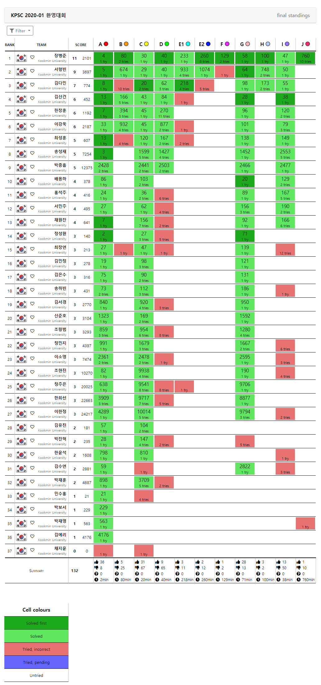
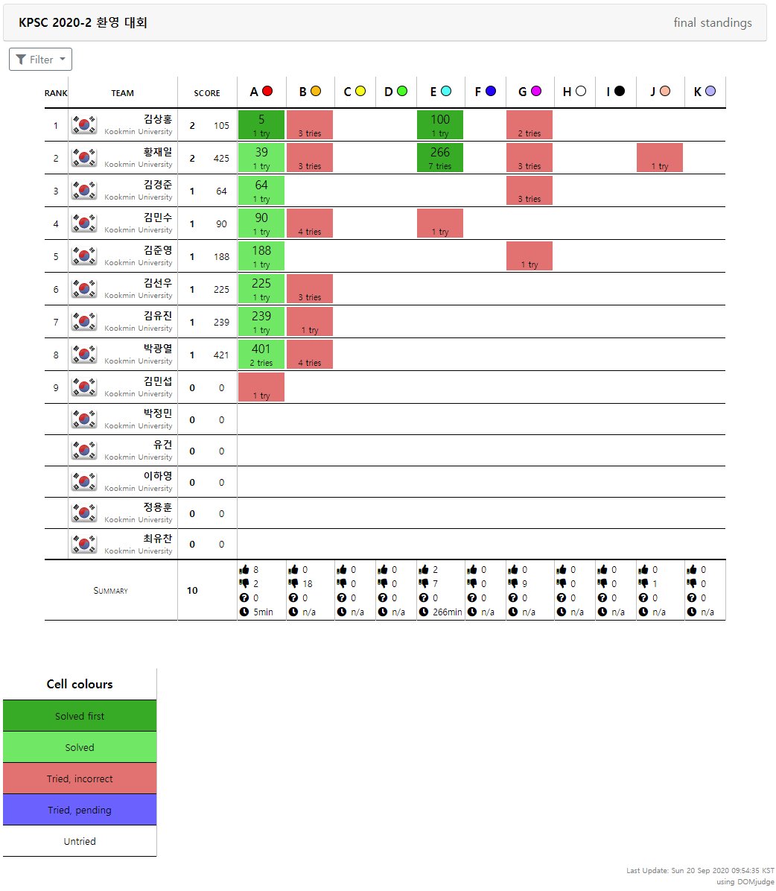
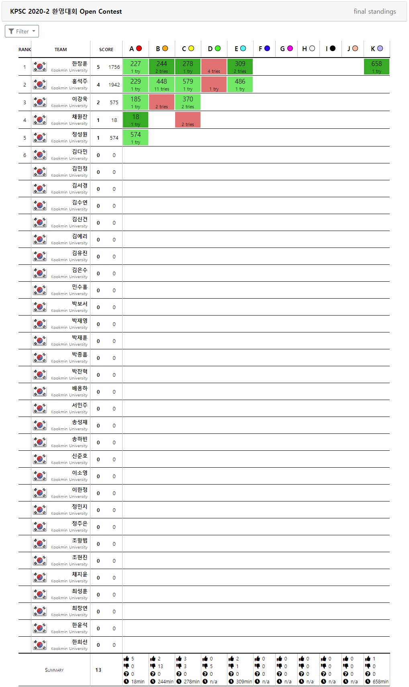
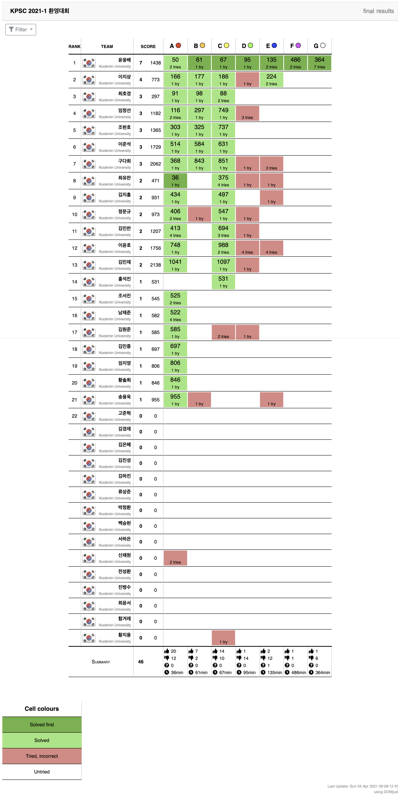
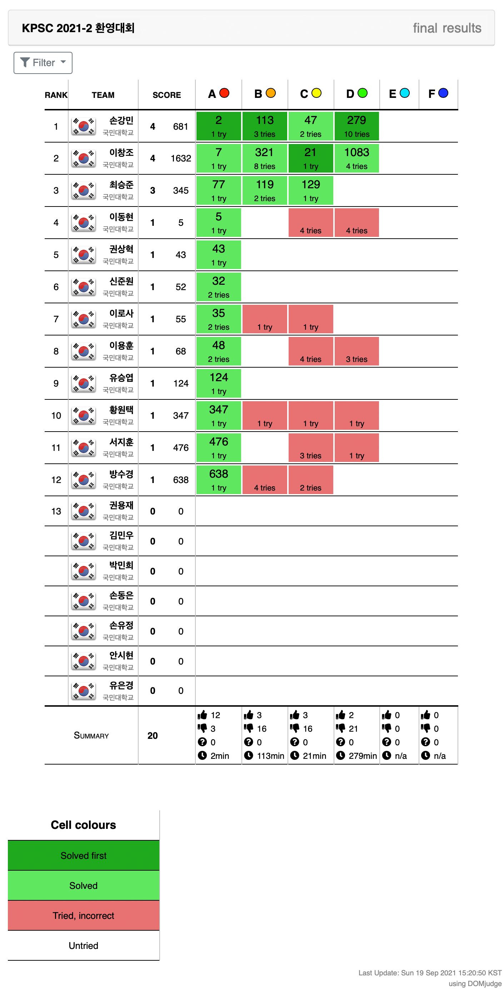

# KPSC 환영대회

## 대회 목록
- [KPSC 2020-1 환영대회](#KPSC-2020-1-환영대회)
- [KPSC 2020-2 환영대회](#KPSC-2020-2-환영대회)
- [KPSC 2021-1 환영대회](#KPSC-2021-1-환영대회)
- [KPSC 2021-2 환영대회](#KPSC-2021-2-환영대회)

---

# KPSC 2020-1 환영대회

* KPSC Welcome Contest 2020-1 (KWC2020-1)
* 2020 3/28 (토) 0시 0분 ~ 4/3 (금) 23시 59분(7일간)

## 개요

KPSC가 기존 알고리즘 동아리를 물려받아 올해 새로 시작하면서 새로운 동아리 부원을 받고자 개최한 첫 대회입니다.

무려 30명 넘게 참여해 주셨고, 모두들 활발하게 대회에 임해 주셨습니다. 출제진들의 예상을 제치고 all solve가 한명 나온 대회입니다.

## 대회 운영진

박정현, 윤상건 - 문제 출제 및 대회 운영

## 문제 목록

[에디토리얼](https://github.com/KMUCS-KPSC/Welcome-Contest/blob/master/Editorial/KPSC%202020-1%20%ED%99%98%EC%98%81%EB%8C%80%ED%9A%8C%20%EC%97%90%EB%94%94%ED%86%A0%EB%A6%AC%EC%96%BC.md)

|    | 문제이름         | 제출 | 정답 | 정답비율 | 풀린시간 | First Solver | 출제자 |
|----|------------------|------|------|----------|----------|--------------|--------|
| A  | [야바위](https://github.com/KMUCS-KPSC/Welcome-Contest/blob/master/Problems/KWC%202020-1/A-%EC%95%BC%EB%B0%94%EC%9C%84.pdf)           | 53   | 45   | 84.9%    | 2분      | 정성원       | 박정현 |
| C  | [동전배분](https://github.com/KMUCS-KPSC/Welcome-Contest/blob/master/Problems/KWC%202020-1/C-%EB%8F%99%EC%A0%84%20%EB%B0%B0%EB%B6%84.pdf)         | 100  | 33   | 33.0%    | 20분     | 김다민       | 박정현 |
| I  | [계단오르기](https://github.com/KMUCS-KPSC/Welcome-Contest/blob/master/Problems/KWC%202020-1/I-%EA%B3%84%EB%8B%A8%20%EC%98%A4%EB%A5%B4%EA%B8%B0.pdf)       | 63   | 13   | 20.6%    | 38분     | 김신건       | 박정현 |
| D  | [적절한수열](https://github.com/KMUCS-KPSC/Welcome-Contest/blob/master/Problems/KWC%202020-1/D-%EC%A0%81%EC%A0%88%ED%95%9C%20%EC%88%98%EC%97%B4.pdf)       | 74   | 9    | 12.1%    | 40분     | 장병준       | 박정현 |
| G  | [업 앤 다운](https://github.com/KMUCS-KPSC/Welcome-Contest/blob/master/Problems/KWC%202020-1/G-%EC%97%85%20%EC%95%A4%20%EB%8B%A4%EC%9A%B4.pdf)       | 44   | 31   | 70.4%    | 71분     | 배용하       | 박정현 |
| B  | [탈게 너무 많아](https://github.com/KMUCS-KPSC/Welcome-Contest/blob/master/Problems/KWC%202020-1/B-%ED%83%88%EA%B2%8C%20%EB%84%88%EB%AC%B4%20%EB%A7%8E%EC%95%84.pdf)   | 30   | 5    | 16.7%    | 80분     | 장병준       | 윤상건 |
| H  | [공장 모양 만들기](https://github.com/KMUCS-KPSC/Welcome-Contest/blob/master/Problems/KWC%202020-1/H-%EA%B3%B5%EC%9E%A5%20%EB%AA%A8%EC%96%91%20%EB%A7%8C%EB%93%A4%EA%B8%B0.pdf) | 5    | 3    | 60.0%    | 100분    | 장병준       | 윤상건 |
| F  | [업무 효율 높이기](https://github.com/KMUCS-KPSC/Welcome-Contest/blob/master/Problems/KWC%202020-1/F-%EC%97%85%EB%AC%B4%20%ED%9A%A8%EC%9C%A8%20%EB%86%92%EC%9D%B4%EA%B8%B0.pdf) | 3    | 1    | 33.3%    | 129분    | 장병준       | 윤상건 |
| E1 | [상건 쿠폰 (Easy)](https://github.com/KMUCS-KPSC/Welcome-Contest/blob/master/Problems/KWC%202020-1/E1-%EC%83%81%EA%B1%B4%20%EC%BF%A0%ED%8F%B0%20(Easy).pdf) | 15   | 3    | 14.3%    | 218분    | 김다민       | 윤상건 |
| E2 | [상건 쿠폰 (Hard)](https://github.com/KMUCS-KPSC/Welcome-Contest/blob/master/Problems/KWC%202020-1/E2-%EC%83%81%EA%B1%B4%20%EC%BF%A0%ED%8F%B0%20(Hard).pdf) | 14   | 2    | 14.2%    | 260분    | 장병준       | 윤상건 |
| J  | [제 3차 세계대전](https://github.com/KMUCS-KPSC/Welcome-Contest/blob/master/Problems/KWC%202020-1/J-%EC%A0%9C%203%EC%B0%A8%20%EC%84%B8%EA%B3%84%EB%8C%80%EC%A0%84.pdf)  | 11   | 1    | 9.0%     | 760분    | 장병준       | 윤상건 |

## 1등

|      | 이름 | BOJ 핸들                                          |
| ---- | ------ | ------------------------------------------------- |
| 1    | 장병준 | [sunjbs98](https://www.acmicpc.net/user/sunjbs98) |

## 스코어 보드

---

# KPSC 2020-2 환영대회

* KPSC Welcome Contest 2020-2 (KWC2020-2)
* 9/19(토) 9시 0분 ~ 9/20(일) 9시 0분 (24시간)

## 개요

KPSC 2020년도 2학기 동아리원 모집에 지원하신 분들을 대상으로 최종 가입승인 여부를 결정하기 위해 진행한 대회입니다.

동아리원들을 대상으로 진행하는 Open Contest도 같이 진행되었습니다.

## 대회 운영진

박정현, 윤상건 - 문제 출제 및 대회 운영

장병준, 서형빈 - 문제 출제

허준영 - 문제 출제(외부 출제자)

## 문제 목록

[에디토리얼](https://github.com/KMUCS-KPSC/Welcome-Contest/blob/master/Editorial/KPSC%202020-2%20%ED%99%98%EC%98%81%EB%8C%80%ED%9A%8C%20%EC%97%90%EB%94%94%ED%86%A0%EB%A6%AC%EC%96%BC.md)

| 난이도순 | 문제이름         | 제출 | 정답 | 정답비율 | 풀린시간 | First Solver | 출제자 |
|----|------------------|------|------|----------|----------|--------------|--------|
| A | [자릿값](https://github.com/KMUCS-KPSC/Welcome-Contest/blob/master/Problems/KWC%202020-2/A-%EC%9E%90%EB%A6%BF%EA%B0%92.pdf) | 10 | 8 | 80% | 5분 | 김상홍 | 박정현 |
| F | [당신은 한 번만 봅니다](https://github.com/KMUCS-KPSC/Welcome-Contest/blob/master/Problems/KWC%202020-2/F-%EB%8B%B9%EC%8B%A0%EC%9D%80%20%ED%95%9C%20%EB%B2%88%EB%A7%8C%20%EB%B4%85%EB%8B%88%EB%8B%A4.pdf) | 0 | 0 | 0% | - | - | 윤상건 |
| E | [열등고등학교](https://github.com/KMUCS-KPSC/Welcome-Contest/blob/master/Problems/KWC%202020-2/E-%EC%97%B4%EB%93%B1%EA%B3%A0%EB%93%B1%ED%95%99%EA%B5%90.pdf) | 9 | 2 | 22% | 100분 | 김상홍 | 박정현 |
| B | [게임 서버](https://github.com/KMUCS-KPSC/Welcome-Contest/blob/master/Problems/KWC%202020-2/B-%EA%B2%8C%EC%9E%84%20%EC%84%9C%EB%B2%84.pdf) | 18 | 0 | 0% | - | - | 박정현 |
| C | [사다리 타기](https://github.com/KMUCS-KPSC/Welcome-Contest/blob/master/Problems/KWC%202020-2/C-%EC%82%AC%EB%8B%A4%EB%A6%AC%20%ED%83%80%EA%B8%B0.pdf) | 0 | 0 | 0% | - | - | 박정현 |
| K | [2xN 타일링?](https://github.com/KMUCS-KPSC/Welcome-Contest/blob/master/Problems/KWC%202020-2/K-2xN%20%ED%83%80%EC%9D%BC%EB%A7%81_.pdf) | 0 | 0 | 0% | - | - | 서형빈 |
| D | [통나무 자르기](https://github.com/KMUCS-KPSC/Welcome-Contest/blob/master/Problems/KWC%202020-2/D-%ED%86%B5%EB%82%98%EB%AC%B4%20%EC%9E%90%EB%A5%B4%EA%B8%B0.pdf) | 0 | 0 | 0% | - | - | 박정현 |
| H | [석탄 나르기](https://github.com/KMUCS-KPSC/Welcome-Contest/blob/master/Problems/KWC%202020-2/H-%EC%84%9D%ED%83%84%20%EB%82%98%EB%A5%B4%EA%B8%B0.pdf) | 0 | 0 | 0% | - | - | 허준영 |
| G | [유한 힐베르트 호텔](https://github.com/KMUCS-KPSC/Welcome-Contest/blob/master/Problems/KWC%202020-2/G-%EC%9C%A0%ED%95%9C%20%ED%9E%90%EB%B2%A0%EB%A5%B4%ED%8A%B8%20%ED%98%B8%ED%85%94.pdf) | 9 | 0 | 0% | - | - | 윤상건 |
| J | [XYZ](https://github.com/KMUCS-KPSC/Welcome-Contest/blob/master/Problems/KWC%202020-2/J-XYZ.pdf) | 1 | 0 | 0% | - | - | 장병준 |
| I | [플랫랜드2: 전쟁의 시작](https://github.com/KMUCS-KPSC/Welcome-Contest/blob/master/Problems/KWC%202020-2/I-%ED%94%8C%EB%9E%AB%EB%9E%9C%EB%93%9C2_%20%EC%A0%84%EC%9F%81%EC%9D%98%20%EC%8B%9C%EC%9E%91.pdf) | 0 | 0 | 0% | - | - | 윤상건 |

- Open Contest

| 난이도순 | 문제이름         | 제출 | 정답 | 정답비율 | 풀린시간 | First Solver | 출제자 |
|----|------------------|------|------|----------|----------|--------------|--------|
| A | [자릿값](https://github.com/KMUCS-KPSC/Welcome-Contest/blob/master/Problems/KWC%202020-2/A-%EC%9E%90%EB%A6%BF%EA%B0%92.pdf) | 5 | 5 | 100% | 18분 | 채원찬 | 박정현 |
| F | [당신은 한 번만 봅니다](https://github.com/KMUCS-KPSC/Welcome-Contest/blob/master/Problems/KWC%202020-2/F-%EB%8B%B9%EC%8B%A0%EC%9D%80%20%ED%95%9C%20%EB%B2%88%EB%A7%8C%20%EB%B4%85%EB%8B%88%EB%8B%A4.pdf) | 0 | 0 | 0% | - | - | 윤상건 |
| E | [열등고등학교](https://github.com/KMUCS-KPSC/Welcome-Contest/blob/master/Problems/KWC%202020-2/E-%EC%97%B4%EB%93%B1%EA%B3%A0%EB%93%B1%ED%95%99%EA%B5%90.pdf) | 3 | 2 | 67% | 309분 | 한창훈 | 박정현 |
| B | [게임 서버](https://github.com/KMUCS-KPSC/Welcome-Contest/blob/master/Problems/KWC%202020-2/B-%EA%B2%8C%EC%9E%84%20%EC%84%9C%EB%B2%84.pdf) | 15 | 2 | 13% | 244분 | 한창훈 | 박정현 |
| C | [사다리 타기](https://github.com/KMUCS-KPSC/Welcome-Contest/blob/master/Problems/KWC%202020-2/C-%EC%82%AC%EB%8B%A4%EB%A6%AC%20%ED%83%80%EA%B8%B0.pdf) | 6 | 3 | 50% | 278분 | 한창훈 | 박정현 |
| K | [2xN 타일링?](https://github.com/KMUCS-KPSC/Welcome-Contest/blob/master/Problems/KWC%202020-2/K-2xN%20%ED%83%80%EC%9D%BC%EB%A7%81_.pdf) | 1 | 1 | 100% | 658분 | 한창훈 | 서형빈 |
| D | [통나무 자르기](https://github.com/KMUCS-KPSC/Welcome-Contest/blob/master/Problems/KWC%202020-2/D-%ED%86%B5%EB%82%98%EB%AC%B4%20%EC%9E%90%EB%A5%B4%EA%B8%B0.pdf) | 5 | 0 | 0% | - | - | 박정현 |
| H | [석탄 나르기](https://github.com/KMUCS-KPSC/Welcome-Contest/blob/master/Problems/KWC%202020-2/H-%EC%84%9D%ED%83%84%20%EB%82%98%EB%A5%B4%EA%B8%B0.pdf) | 0 | 0 | 0% | - | - | 허준영 |
| G | [유한 힐베르트 호텔](https://github.com/KMUCS-KPSC/Welcome-Contest/blob/master/Problems/KWC%202020-2/G-%EC%9C%A0%ED%95%9C%20%ED%9E%90%EB%B2%A0%EB%A5%B4%ED%8A%B8%20%ED%98%B8%ED%85%94.pdf) | 0 | 0 | 0% | - | - | 윤상건 |
| J | [XYZ](https://github.com/KMUCS-KPSC/Welcome-Contest/blob/master/Problems/KWC%202020-2/J-XYZ.pdf) | 0 | 0 | 0% | - | - | 장병준 |
| I | [플랫랜드2: 전쟁의 시작](https://github.com/KMUCS-KPSC/Welcome-Contest/blob/master/Problems/KWC%202020-2/I-%ED%94%8C%EB%9E%AB%EB%9E%9C%EB%93%9C2_%20%EC%A0%84%EC%9F%81%EC%9D%98%20%EC%8B%9C%EC%9E%91.pdf) | 0 | 0 | 0% | - | - | 윤상건 |

## 1등

|      | 이름 | BOJ 핸들                                          |
| ---- | ------ | ------------------------------------------------- |
| 1 | 김상홍 | [bconfiden2](https://www.acmicpc.net/user/bconfiden2) |

- Open Contest

|      | 이름 | BOJ 핸들                                          |
| ---- | ------ | ------------------------------------------------- |
| 1 | 한창훈 | [noye](https://www.acmicpc.net/user/noye) |

## 스코어 보드

- Open Contest

---

# KPSC 2021-1 환영대회

* KPSC Welcome Contest 2021-1 (KWC2021-2)
* 4/3(토) 9시 0분 ~ 4/4(일) 9시 0분 (24시간)

## 개요

KPSC 2021년도 1학기 동아리원 모집에 지원하신 분들을 대상으로 최종 가입승인 여부를 결정하기 위해 진행한 대회입니다.

2020년도 1학기와 마찬가지로 무려 30명 넘게 참여해 주셨고, 모두들 활발하게 대회에 임해 주셨습니다. all solve가 한명 나오기도 했습니다.

## 대회 운영진

박정현, 윤상건 - 문제 출제 및 대회 운영

장병준 - 문제 출제

허준영 - 문제 출제(외부 출제자)

## 문제 목록

[에디토리얼](https://github.com/KMUCS-KPSC/Welcome-Contest/blob/master/Editorial/KPSC%202021-1%20%ED%99%98%EC%98%81%EB%8C%80%ED%9A%8C%20%EC%97%90%EB%94%94%ED%86%A0%EB%A6%AC%EC%96%BC.md)

|    | 문제이름         | 제출 | 정답 | 정답비율 | 풀린시간 | First Solver | 출제자 |
|----|------------------|------|------|----------|----------|--------------|--------|
| A  | [슬롯머신](https://github.com/KMUCS-KPSC/Welcome-Contest/blob/master/Problems/KWC%202021-1/A-%EC%8A%AC%EB%A1%AF%EB%A8%B8%EC%8B%A0.pdf)           | 34   | 21   | 61.7%    | 36분      | 최유찬       | 박정현 |
| B  | [나로코 바이러스](https://github.com/KMUCS-KPSC/Welcome-Contest/blob/master/Problems/KWC%202021-1/B-%EB%82%98%EB%A1%9C%EC%BD%94%20%EB%B0%94%EC%9D%B4%EB%9F%AC%EC%8A%A4.pdf)         | 9  | 7   | 77.8%    | 61분     | 윤웅배       | 박정현 |
| C  | [카드게임 (SMALL)](https://github.com/KMUCS-KPSC/Welcome-Contest/blob/master/Problems/KWC%202021-1/C-%EC%B9%B4%EB%93%9C%EA%B2%8C%EC%9E%84%20(SMALL).pdf)       | 24   | 14   | 58.3%    | 67분     | 윤웅배       | 박정현 |
| D  | [카드게임 (LARGE)](https://github.com/KMUCS-KPSC/Welcome-Contest/blob/master/Problems/KWC%202021-1/D-%EC%B9%B4%EB%93%9C%EA%B2%8C%EC%9E%84%20(LARGE).pdf)       | 15   | 1    | 6.7%    | 95분     | 윤웅배       | 박정현 |
| E  | [ENLIST](https://github.com/KMUCS-KPSC/Welcome-Contest/blob/master/Problems/KWC%202021-1/E-ENLIST.pdf)       | 15   | 2   | 13.3%    | 135분     | 윤웅배       | 장병준 |
| F  | [파스칼의 삼각형과 쿼리](https://github.com/KMUCS-KPSC/Welcome-Contest/blob/master/Problems/KWC%202021-1/F-%ED%8C%8C%EC%8A%A4%EC%B9%BC%EC%9D%98%20%EC%82%BC%EA%B0%81%ED%98%95%EA%B3%BC%20%EC%BF%BC%EB%A6%AC.pdf)   | 2   | 1    | 50.0%    | 364분     | 윤웅배       | 허준영 |
| G  | [Taste Why Frame](https://github.com/KMUCS-KPSC/Welcome-Contest/blob/master/Problems/KWC%202021-1/G-Taste%20Why%20Frame.pdf) | 7    | 1    | 14.2%    | 486분    | 윤웅배       | 윤상건 |

## 1등

|      | 이름 | BOJ 핸들                                          |
| ---- | ------ | ------------------------------------------------- |
| 1 | 윤웅배 | [devbelly](https://www.acmicpc.net/user/devbelly) |

## 스코어 보드

---

# KPSC 2021-2 환영대회

* KPSC Welcome Contest 2021-2 (KWC2021-2)
* 2021/09/18(토) 13시 0분 ~ 2021/09/19(일) 13시 0분(24시간)

## 개요

KPSC 2021년도 2학기 동아리원 모집에 지원하신 분들을 대상으로 최종 가입승인 여부를 결정하기 위해 진행한 대회입니다.

## 대회 운영진

박정현, 윤상건 - 문제 출제 및 대회 운영

## 문제 목록

[에디토리얼](https://github.com/KMUCS-KPSC/Welcome-Contest/blob/master/Editorial/KPSC%202021-2%20환영대회%20에디토리얼.md)

|    | 문제이름         | 제출 | 정답 | 정답비율 | 풀린시간 | First Solver | 출제자 |
|----|----------------|-----|-----|--------|-------|--------------|------|
| A  | [OnlineJudge](https://github.com/KMUCS-KPSC/Welcome-Contest/blob/master/Problems/KWC%202021-2/A-Online%20Judge.pdf) | 15 | 12   | 80% | 2분 | 손강민 | 박정현 |
| B  | [E-doc SV Extension](https://github.com/KMUCS-KPSC/Welcome-Contest/blob/master/Problems/KWC%202021-2/B-E-doc%20SV%20Extension.pdf) | 19  | 3   | 15.8%    | 113분     | 손강민       | 박정현 |
| C  | [생일 선물](https://github.com/KMUCS-KPSC/Welcome-Contest/blob/master/Problems/KWC%202021-2/C-생일%20선물.pdf) | 19   | 3   | 15.8%    | 21분     | 이창조       | 박정현 |
| D  | [톰 양궁](https://github.com/KMUCS-KPSC/Welcome-Contest/blob/master/Problems/KWC%202021-2/D-톰%20양궁.pdf) | 23   | 2    | 8.7%    | 279분     | 손강민       | 박정현 |
| E  | [졸나라](https://github.com/KMUCS-KPSC/Welcome-Contest/blob/master/Problems/KWC%202021-2/E-졸나라.pdf) | 0   | 0   | 0%    | -     | -       | 윤상건 |
| F  | [다중우주](https://github.com/KMUCS-KPSC/Welcome-Contest/blob/master/Problems/KWC%202021-2/F-다중우주.pdf) | 0   | 0    | 0%    | -     | -       | 윤상건 |

## 1등

|      | 이름 | BOJ 핸들                                          |
| ---- | ------ | ------------------------------------------------- |
| 1    | 손강민 | [gangminson](https://www.acmicpc.net/user/gangminson) |

## 스코어 보드

